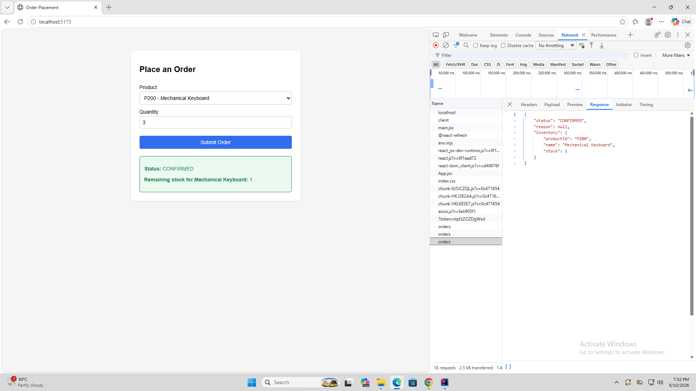
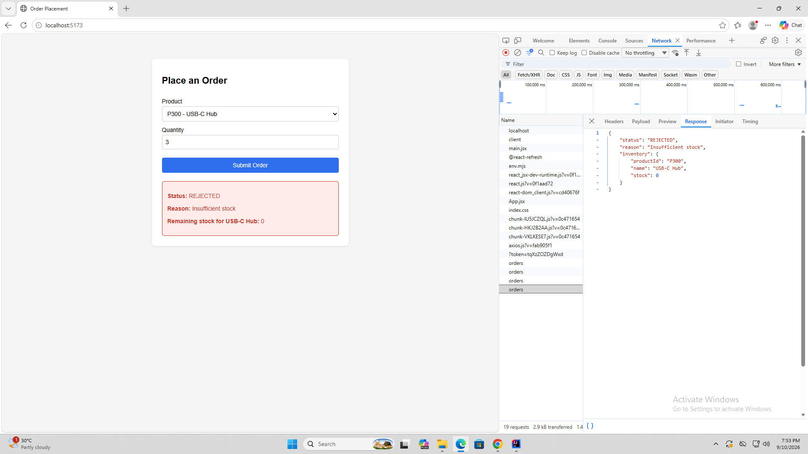

# Shop + Inventory — In-Process Module Integration

A single Spring Boot application with two internally-integrated modules
(Order and Inventory) backed by a shared Supabase (Postgres) database, plus
a React (Vite) frontend that talks to it over REST.

## Package Structure

```
edu.cit.abella                 - @SpringBootApplication (scans both modules)
edu.cit.abella.shop             - Order module (public)
edu.cit.abella.inventory        - Inventory module (enforced boundary)
```

## Supabase Setup

1. Create a free project at [supabase.com](https://supabase.com).
2. In the Supabase dashboard, go to **Project Settings → Database** and copy:
   - The connection string (use the "Session pooler" or direct connection URI, in JDBC form)
   - Your database username (usually `postgres`)
   - Your database password (the one you set when creating the project)
3. Open the **SQL Editor** in Supabase and run the script at `sql/schema.sql` from this repo. This creates the `inventory` and `orders` tables and seeds the three products.
4. Set these as environment variables on your machine (never commit them):
   ```bash
   export SUPABASE_DB_URL="jdbc:postgresql://<your-project-ref>.supabase.co:5432/postgres"
   export SUPABASE_DB_USERNAME="postgres"
   export SUPABASE_DB_PASSWORD="your-db-password"
   ```
   On Windows (PowerShell):
   ```powershell
   $env:SUPABASE_DB_URL="jdbc:postgresql://<your-project-ref>.supabase.co:5432/postgres"
   $env:SUPABASE_DB_USERNAME="postgres"
   $env:SUPABASE_DB_PASSWORD="your-db-password"
   ```
   In IntelliJ, you can also set these under **Run/Debug Configurations → Environment Variables** instead of exporting them in a shell.

## Backend Setup

```bash
cd backend
mvn spring-boot:run
```

Starts on `http://localhost:8080`.

## Frontend Setup

```bash
cd frontend
npm install
npm run dev
```

Starts on `http://localhost:5173`.

## API

**POST** `/api/orders`

Request:
```json
{ "productId": "P100", "quantity": 5 }
```

Response (confirmed):
```json
{
  "status": "CONFIRMED",
  "reason": null,
  "inventory": { "productId": "P100", "name": "Wireless Mouse", "stock": 20 }
}
```

Response (rejected — insufficient stock):
```json
{
  "status": "REJECTED",
  "reason": "Insufficient stock",
  "inventory": { "productId": "P300", "name": "USB-C Hub", "stock": 0 }
}
```

## Network Tab Evidence

_Insert screenshots here of the browser DevTools Network tab showing:_
1. A **CONFIRMED** order — request payload and response body.

2. A **REJECTED** order (e.g. ordering more than available stock of P300) — request payload and response body.

## Reflection

### 1. In-process vs. separate microservices over a network

Calling `InventoryService.reserve()` in-process is a direct Java method call: it's synchronous, type-checked at compile time, and shares the same JVM memory space and transaction. Because both modules ultimately write to the same Postgres database in this design, I get transactional consistency essentially for free — if something failed mid-operation, both the inventory update and the order write are happening in the same request lifecycle without needing to coordinate across services. There's also no network there at all: no serialization, no latency, no partial-failure handling, and no need to think about retries or timeouts, because a plain method call either returns or throws.

If I split Inventory into a separate microservice communicating over HTTP or messaging, all of that changes. I would need to add: network resilience (retries, timeouts, circuit breakers) since a call to Inventory could now fail independently of Order; a way to handle partial failures, since an order and an inventory reservation would no longer be one atomic unit of work — I'd likely need a saga pattern or compensating transactions to undo a reservation if the order step fails afterward; serialization/deserialization overhead and a versioned API contract between the two services; and probably a discovery mechanism or fixed service URL, plus authentication between the two services since they'd no longer implicitly trust each other via the JVM boundary. Testing also becomes more involved — instead of unit-testing a Java interface, I'd need integration tests or contract tests against a real or mocked network boundary.

### 2. Why package-private `InventoryServiceImpl` matters

Making `InventoryServiceImpl` package-private means no code outside the `edu.cit.abella.inventory` package can even reference the class name — the Java compiler itself blocks it, not just a coding convention or code review comment. The Order module is physically only able to depend on the `InventoryService` interface (and the `InventoryItem`/`ReservationResult` DTOs), because that's literally all it can see.

If `InventoryServiceImpl` were public, nothing would stop another developer (or my future self) from injecting the concrete class directly, calling implementation-specific methods that aren't on the interface, or new-ing it up manually and bypassing Spring's dependency injection entirely. That would silently break the "module boundary" the whole exercise is about: the Inventory module's internal Repository/Entity classes could get tangled into Order's code, and refactoring the Inventory module later (e.g. changing how reservations are stored, or swapping the persistence technology) could break Order module code in ways the compiler wouldn't catch until much later. Package-private visibility turns a design intention into a compiler-enforced guarantee.

### 3. When to extract Inventory into its own microservice

I'd consider extracting Inventory once it needs to scale, evolve, or be operated independently from Order — for example, if multiple different services (not just this Order module) needed to reserve stock, if Inventory's read/write load became disproportionately heavy compared to Order and needed separate scaling, if Inventory needed a different release cadence or ownership by a separate team, or if I wanted to swap its storage engine without touching Order at all.

To actually do this, I would need to: replace the direct `InventoryService` interface implementation with an HTTP (or messaging) client that implements the same interface shape, so `OrderService` ideally wouldn't need to change much if the interface is preserved as a "port"; add a real REST API (or gRPC/message queue) on the Inventory side exposing `getItem`/`reserve` as network operations; introduce serialization (JSON DTOs) crossing the network instead of passing Java objects by reference; add resilience (timeouts, retries, circuit breaking) around that client, since the call can now fail for reasons that have nothing to do with business logic (network partition, service down); rethink the transaction boundary, since I could no longer save the Order row and update inventory stock atomically in one database transaction — I'd need either a saga/compensation step, or accept eventual consistency and reconcile any anomalies afterward; and finally, give Inventory its own database (or at least its own schema/credentials) rather than sharing the same Postgres instance directly, since a separate service shouldn't reach into another service's tables.
