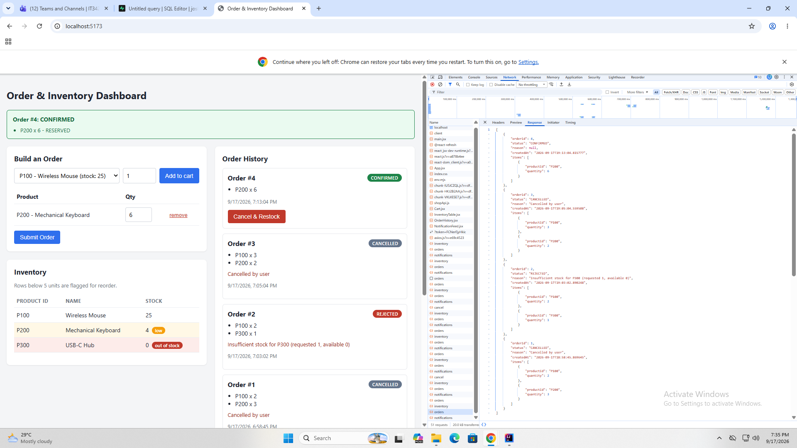
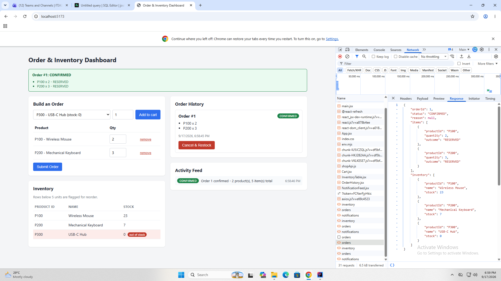
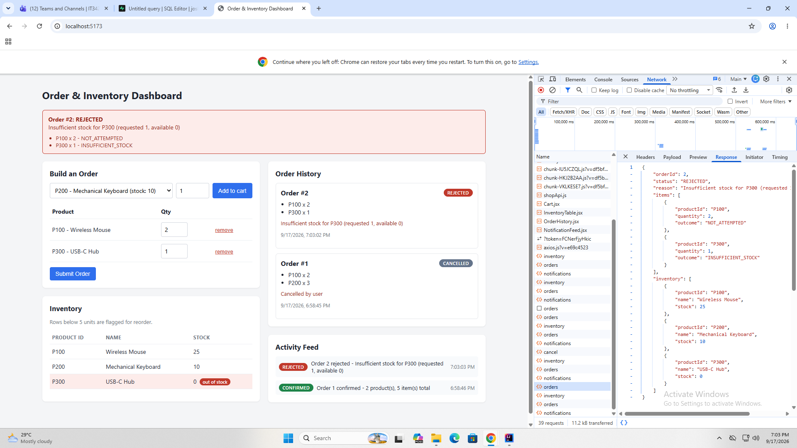
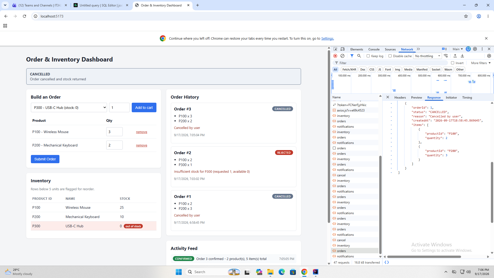
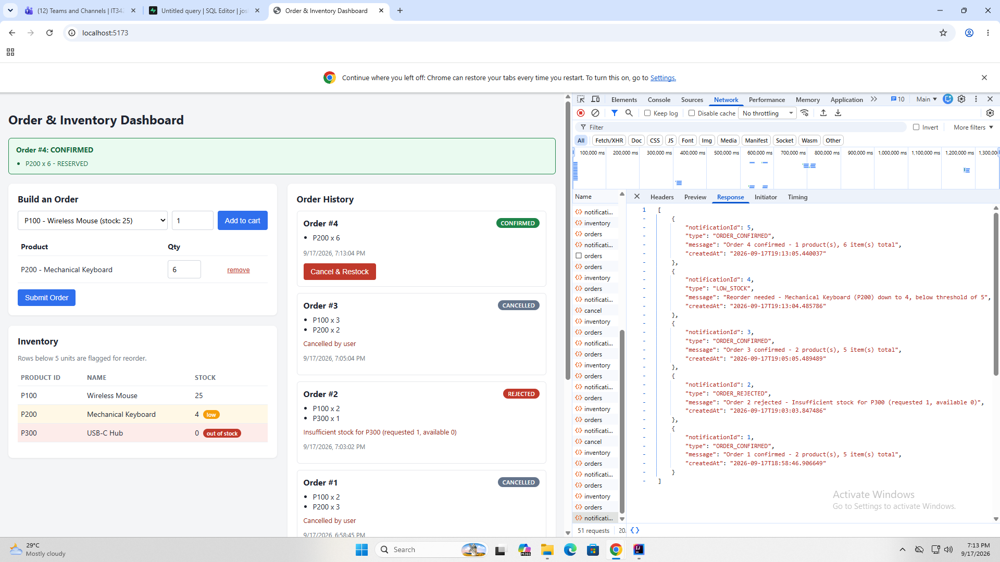

# Modular Monolith — Order, Inventory & Notification (Lab 2)

A single Spring Boot deployable with three internally-integrated modules,
backed by Supabase (Postgres), with a React (Vite) frontend over REST.

Lab 2 adds: multi-item orders with all-or-nothing rollback, order
cancellation with restock, read endpoints for a live dashboard, in-process
domain events consumed by a new Notification module, and a low-stock
auto-reorder rule.

## Module Structure

```
edu.cit.abella                  - @SpringBootApplication (scans everything below)
edu.cit.abella.events           - shared domain event classes (neutral package)
edu.cit.abella.shop             - Order module
edu.cit.abella.inventory        - Inventory module (package-private impl)
edu.cit.abella.notification     - Notification module (event consumer only)
edu.cit.abella.config           - CORS
```

**Boundary rules enforced in code:**

- `InventoryServiceImpl`, `InventoryEntity` and `InventoryRepository` are package-private. Order can name `InventoryService`, `InventoryItem` and `ReservationResult` — nothing else.
- `OrderService` imports `ApplicationEventPublisher` and the event classes. It has no import from `edu.cit.abella.notification`.
- `NotificationListener` imports only the three event classes. It has no reference to `OrderService` or `InventoryService`.
- The event classes live in their own `events` package so the dependency arrow points from all three modules to a shared, behaviour-free package rather than between modules.

## Supabase Setup

1. Create a free project at [supabase.com](https://supabase.com).
2. Click **Connect** on the project home page → **Direct connection** or **Session pooler** → set **Type** to **JDBC** → copy the connection string. (Session pooler works over IPv4 and doesn't need the paid IPv4 add-on; note it uses port `6543` and a username in the form `postgres.<project-ref>`.)
3. Open the **SQL Editor**, paste the contents of `sql/schema.sql`, and run it. Choose **"Run without RLS"** when prompted — the backend connects as the Postgres user over JDBC, not via Supabase's anon-key REST API, so RLS policies aren't what protects these tables here.
4. Set the credentials as environment variables (never commit them):

   ```bash
   export SUPABASE_DB_URL="jdbc:postgresql://aws-0-<region>.pooler.supabase.com:6543/postgres"
   export SUPABASE_DB_USERNAME="postgres.<project-ref>"
   export SUPABASE_DB_PASSWORD="your-db-password"
   ```

   PowerShell:
   ```powershell
   $env:SUPABASE_DB_URL="jdbc:postgresql://aws-0-<region>.pooler.supabase.com:6543/postgres"
   $env:SUPABASE_DB_USERNAME="postgres.<project-ref>"
   $env:SUPABASE_DB_PASSWORD="your-db-password"
   ```

   In IntelliJ, set these under **Run → Edit Configurations → Environment variables** instead.

## Running

```bash
cd backend && mvn spring-boot:run     # http://localhost:8080
cd frontend && npm install && npm run dev   # http://localhost:5173
```

## API

| Endpoint | Method | Purpose |
|---|---|---|
| `/api/orders` | POST | Place a multi-item order |
| `/api/orders` | GET | Order history with line items |
| `/api/orders/{orderId}/cancel` | POST | Cancel an order and restock every line |
| `/api/inventory` | GET | All products with current stock + threshold |
| `/api/notifications` | GET | Activity log (confirmations, rejections, reorder alerts) |

**POST /api/orders**

```json
{ "items": [{ "productId": "P100", "quantity": 2 }, { "productId": "P200", "quantity": 3 }] }
```

```json
{
  "orderId": 7,
  "status": "CONFIRMED",
  "reason": null,
  "items": [
    { "productId": "P100", "quantity": 2, "outcome": "RESERVED" },
    { "productId": "P200", "quantity": 3, "outcome": "RESERVED" }
  ],
  "inventory": [ /* full screenshot below after the order settled */ ]
}
```


On rejection, `outcome` is `INSUFFICIENT_STOCK` / `PRODUCT_NOT_FOUND` / `INVALID_QUANTITY` for the offending line and `NOT_ATTEMPTED` for lines that passed validation but were never reserved — which is the point: nothing was reserved.

**Status codes:** `200` for both CONFIRMED and REJECTED (both are valid business outcomes); `400` only for a malformed request body; `404` cancelling an unknown order; `409` cancelling an order that is already CANCELLED or that is REJECTED (a rejected order never reserved stock, so restocking it would create inventory from nothing).

## Design Notes

**Duplicate line items are collapsed before validation.** A cart holding P200 ×6 twice is merged into P200 ×12 before anything is checked. Without this, each line would validate independently (6 ≤ 10, twice) and then reserve 12 units from a stock of 10 — the validate-then-reserve split would be defeated by the cart itself.

**Event listeners are synchronous — deliberately not `@Async`.** Spring's `@EventListener` runs on the publishing thread by default, inside the caller's transaction. That is what I want here: the notification write and the order write commit or roll back together, so the activity feed can never show a confirmation for an order that failed to persist. Making them `@Async` would move the listener to a separate thread with its own transaction, which buys throughput (the HTTP response wouldn't wait on the notification insert) at the cost of that guarantee — the order could commit while the notification silently fails, and I'd need a retry or outbox mechanism to close the gap. At this scale the insert is trivially fast, so the consistency is worth more than the microseconds. It is worth noting that this synchronous coupling is also the thing that stops being free the moment Notification moves out of process.

## Network Tab Evidence

_Insert DevTools → Network screenshots (Payload + Response for each):_

1. **Multi-item order, all items succeed** — e.g. P100 ×2 + P200 ×3 → `CONFIRMED`, both lines `RESERVED`.

2. **Multi-item order, one item fails** — e.g. P100 ×2 + P300 ×1 (P300 seeded at 0) → `REJECTED`, and `GET /api/inventory` afterwards shows P100 **unchanged at 25**, proving no partial reservation.

3. **Cancel with restock** — cancel a confirmed order, then `GET /api/inventory` showing the quantities returned.

4. **Notification feed** — `GET /api/notifications` showing an `ORDER_CONFIRMED`, an `ORDER_REJECTED`, and a `LOW_STOCK` entry. (To trigger low stock: order P200 ×6, leaving 4, below the threshold of 5.)


## Reflection

### 1. What keeps multi-item orders atomic in-process, and what would a network split require?

`placeOrder` is annotated `@Transactional`, so every `InventoryService.reserve()` call it makes joins the same Spring-managed transaction and the same JDBC connection. Reserving three products isn't three independent operations that might each half-succeed — it is one unit of work that either commits whole or rolls back whole. If anything throws partway through the reserve loop, every stock decrement already applied in that loop is rolled back by the database itself, along with the order and order_items rows. On top of that I validate the entire cart against current stock *before* calling `reserve()` even once, so the common rejection case (one item short) never touches inventory at all and the rollback path is a fallback rather than the primary mechanism.

Splitting Order and Inventory across a network removes both of those guarantees simultaneously. There is no shared transaction across services, so I'd need to reimplement atomicity at the application level. The realistic approach is a saga with compensating transactions: Order calls Inventory to reserve item 1, then item 2, and if item 3 fails, it must explicitly call a compensating `release()` for items 1 and 2 to undo what already succeeded. That compensation is itself a network call that can fail, so it needs retries with idempotency keys — otherwise a retried release could double-refund stock. I'd also need the reserve call itself to be idempotent, because a timeout tells me nothing about whether the reservation actually happened on the far side. Beyond that: timeouts and circuit breakers so a slow Inventory doesn't hang every order thread, a versioned API contract between the two services, and a reconciliation job to catch the cases where compensation never landed at all. The validate-then-reserve trick still helps — it makes the expensive rollback path rare — but it stops being sufficient, because between validation and reservation another service instance can drain the stock, and across a network that window is much wider.

### 2. How does publishing an event change the coupling with Notification?

Direct invocation would mean `OrderService` holds a reference to something in the notification package — it would have to know that notifications exist, know the method to call, and be recompiled whenever that method's signature changed. Publishing `OrderPlacedEvent` inverts that: `OrderService` announces that something happened and has no idea who, if anyone, is listening. I can add a second listener (an email sender, an audit log) without touching `OrderService` at all, and I can delete the Notification module entirely and the Order module still compiles and runs. The dependency now points from Notification to a shared event class rather than from Order to Notification — Notification depends on Order's *vocabulary*, not on its code.

What the in-process version still shares is a thread and a transaction, and that's exactly what breaks if Notification becomes its own service. I'd need a message broker (RabbitMQ, Kafka) in place of `ApplicationEventPublisher`, and then I have to decide what delivery guarantee I actually need. The dangerous failure is a dual-write: the order commits to Postgres but the broker publish fails, so the event is lost forever and no notification is ever sent. The standard fix is the transactional outbox — write the event to an `outbox` table in the same transaction as the order, then have a separate relay publish it to the broker. That gives at-least-once delivery, which in turn means the consumer must be idempotent, since it will occasionally see the same event twice. I'd also need to handle ordering (does a LowStock event have to arrive after the OrderPlaced that caused it?), a dead-letter queue for events the consumer can never process, and event schema versioning so an older consumer doesn't break when I add a field.

### 3. Which module would I extract first?

Notification, clearly. It's already the loosest-coupled of the three: it consumes events, never calls back into anything, and owns a table nobody else reads. It is also the one whose failure matters least — if a notification is delayed or lost, no stock is wrong and no customer is charged twice, which makes it a safe place to accept the eventual-consistency tradeoff that leaving the monolith forces on you.

The changes are correspondingly small. I'd replace `ApplicationEventPublisher.publishEvent(...)` with a broker publish, ideally behind an interface so the calling code barely changes; add an outbox table and relay so a committed order can't lose its event; move the `notifications` table into the new service's own database rather than sharing Postgres; swap `@EventListener` for a broker listener annotation; and make the handler idempotent by deduplicating on an event ID, since at-least-once delivery will replay events. The event classes themselves would move into a shared contract library or be redefined as a published JSON schema.

Extracting Inventory first would be the worse choice: it's the module Order calls synchronously and transactionally, multiple times per request, and it's the one whose correctness actually matters — pulling it out means immediately taking on the entire saga/compensation problem from question 1 just to keep stock counts honest.
